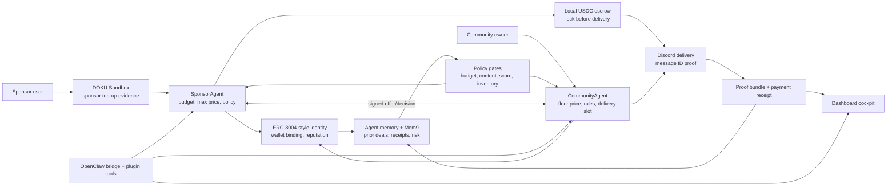

<div align="center">

# AdSourcing

**Agentic sponsorship protocol for community advertising.**

AdSourcing lets `SponsorAgent` and `CommunityAgent` run a sponsorship workflow from mandate, DOKU sponsor top-up evidence, identity checks, negotiation, escrow, Discord delivery proof, settlement, payment receipt, and agent memory.

[](https://theneuralabs.cloud/)


`DOKU top-up -> SponsorAgent -> ERC-8004-style identity -> Policy gates -> Negotiation -> Local USDC escrow -> Discord delivery proof -> Payment receipt -> Agent memory`

</div>

---

## Table of Contents

- [What is AdSourcing?](#what-is-adsourcing)
- [Why this exists](#why-this-exists)
- [Live demo](#live-demo)
- [Demo scenarios](#demo-scenarios)
- [How the sponsorship flow works](#how-the-sponsorship-flow-works)
- [Architecture](#architecture)
- [Payment model](#payment-model)
- [Agent memory and Mem9](#agent-memory-and-mem9)
- [OpenClaw integration](#openclaw-integration)
- [Tech stack](#tech-stack)
- [Quick start](#quick-start)
- [Environment variables](#environment-variables)
- [Development commands](#development-commands)
- [Project structure](#project-structure)
- [Current status and honest limitations](#current-status-and-honest-limitations)
- [Verification checklist](#verification-checklist)
- [Docs](#docs)

## What is AdSourcing?

AdSourcing is a hackathon-built agentic commerce product for community sponsorships.

It has two main agents:

- `SponsorAgent` represents a brand or sponsor. It receives a buying mandate: budget, max price, audience requirements, content policy, wallet authority, and sponsor-side top-up evidence.
- `CommunityAgent` represents a Discord or Telegram community. It receives a selling mandate: price floor, content rules, delivery channel, sponsor reputation threshold, and payout wallet.

After setup, the agents can discover each other, verify identity, negotiate within policy limits, lock payment in escrow, deliver a sponsored post, verify proof, settle payment, write receipts, and store deal memory for future decisions.

Core thesis:

> AdSourcing is not a marketplace UI. The agents are the product. The dashboard, contracts, payment rails, and receipts are the evidence layer.

Short mechanism:

```text
Sponsor prefunds.
Agents verify.
Agents negotiate.
Escrow locks.
Discord proves.
Receipt settles.
Memory improves the next deal.
```

## Why this exists

Small community sponsorships are still too manual.

A brand that wants to sponsor a Discord or Telegram community has to find the right community, ask for rates, negotiate terms, check content safety, handle payment, verify delivery, and keep proof manually.

That process is too expensive for small deals. A USD 30 to USD 40 sponsorship can take the same operational effort as a much larger campaign, so many micro-sponsorships never happen.

AdSourcing explores a different model:

- sponsors delegate bounded buying authority to an agent;
- communities delegate bounded selling authority to an agent;
- identity, reputation, memory, policy, escrow, and proof decide whether a deal can proceed.

## Live demo

Live dashboard:

```text
https://theneuralabs.cloud/
```

Public link:

[https://theneuralabs.cloud/](https://theneuralabs.cloud/)

The dashboard is designed as a judging cockpit. It shows:

- sponsor and community agent state;
- DOKU prefund evidence;
- identity and policy gates;
- local USDC escrow;
- Discord delivery proof;
- proof bundles and payment receipts;
- Mem9/local memory status;
- OpenClaw protocol execution paths;
- bad-case rejection before escrow.

## Demo scenarios

| Scenario | What it proves | Expected result |
| --- | --- | --- |
| Sponsorship Flow | SponsorAgent and CommunityAgent run the main deal loop | DOKU prefund evidence, identity gate, negotiation, escrow, Discord delivery proof, settlement, receipt |
| Bad Case | Unsafe sponsorship content is blocked before funds move | CommunityAgent rejects policy-violating content before escrow |
| OpenClaw + GLM | LLM agent can call the AdSourcing protocol tool | OpenClaw run completes with tool call summary and receipt evidence |
| GLM + Discord Delivery | LLM/tool path can use real Discord delivery when env is configured | Sponsored post appears in Discord and proof is captured |
| Local Protocol Stack | Contract/payment/proof path is deterministic without testnet friction | Local Hardhat contracts, MockUSDC escrow, proof bundle, payment receipt |
| Protocol + Discord Stack | Protocol run plus real Discord bot delivery | Local contract settlement with real Discord message proof |

## How the sponsorship flow works

1. Sponsor creates or attaches a DOKU Sandbox top-up invoice as prefund evidence for the buying mandate.
2. `SponsorAgent` broadcasts sponsorship intent.
3. `CommunityAgent` verifies identity, signature freshness, wallet binding, reputation, prior memory, and inventory.
4. Both agents negotiate inside strict policy limits.
5. `SponsorAgent` locks payment in local USDC escrow.
6. `CommunityAgent` delivers the sponsored post to Discord.
7. `SponsorAgent` verifies the Discord delivery proof.
8. Payment settles and a receipt/proof bundle is generated.
9. Completed deal outcome is stored as agent memory for future risk and pricing decisions.

## Architecture



## Payment model

AdSourcing intentionally separates checkout evidence from settlement.

### DOKU Sandbox prefund

DOKU is used as the sponsor-side fiat top-up / checkout layer in the hackathon demo.

It can:

- generate a DOKU Sandbox invoice;
- return a DOKU payment/top-up link;
- attach that invoice to the sponsor mandate evidence and payment receipt;
- show that the sponsor has a fiat gateway path before autonomous buying begins.

It does not currently:

- auto-convert fiat into USDC;
- settle the community payout;
- enforce webhook-confirmed DOKU payment before escrow;
- represent production merchant settlement.

### Local USDC escrow

The accountable settlement path in the demo is local USDC escrow.

It handles:

- escrow funding before delivery;
- delivery proof logging;
- payment release after proof;
- protocol fee accounting;
- proof bundle and payment receipt generation.

Safe way to describe it:

> DOKU is the sponsor-side top-up evidence layer. Escrow is the proof-based settlement layer.

## Agent memory and Mem9

AdSourcing includes an agent memory layer.

Local memory stores:

- saved sponsor and community mandates;
- recent deal outcomes;
- settlement receipts;
- disputed or rejected deals;
- counterparty history.

When Mem9 is configured, settled sponsorship outcomes are written as long-term memories. The memory payload can include:

- deal ID;
- sponsor wallet;
- community wallet;
- escrow ID;
- delivery proof;
- proof hash;
- payment receipt ID;
- tx hashes;
- deal terms and outcome.

The goal is to help agents avoid treating every counterparty as brand new forever. Prior outcomes can become risk and pricing signals for future sponsorships, while deterministic policy gates still decide whether an action is allowed.

## OpenClaw integration

AdSourcing exposes its engine through an OpenClaw bridge and plugin tools.

OpenClaw can:

- inspect current AdSourcing status;
- save sponsor and community mandates;
- run the local Agenthon protocol path;
- run a bad-case rejection flow;
- step through sponsor/community theater tools;
- fetch evidence, receipts, memory, DOKU status, and bad-case state.

The bridge runs at:

```text
http://localhost:4020/openclaw
```

Core commands:

```bash
npm run openclaw:bridge
```

For the full Agenthon runbook, see [`OPENCLAW_AGENTHON.md`](./OPENCLAW_AGENTHON.md).

## Tech stack

| Layer | Technology |
| --- | --- |
| Agents | TypeScript, Node.js, `SponsorAgent`, `CommunityAgent` |
| Agent orchestration | OpenClaw bridge, OpenClaw plugin tools, GLM-compatible model flow |
| Dashboard | Express server, vanilla HTML/CSS/JS, Three.js visualization |
| Contracts | Solidity, Hardhat, `IntentRegistry`, `AdEscrow`, `MockUSDC` |
| Chain client | Viem |
| Identity and reputation | ERC-8004-style local identity/reputation contracts, mock/live-switchable reputation service |
| Payment gateway extension | DOKU Sandbox MCP checkout/top-up |
| Settlement | Local USDC escrow, proof-based settlement receipts |
| Delivery | Discord.js bot delivery and sponsor-side verification |
| Memory | Local persistence, AgentMemoryService, optional Mem9 integration |
| Evidence | Proof bundles, decision receipts, payment receipts |
| Live/testnet path | Base Sepolia config and deployment scripts |

## Quick start

### Prerequisites

- Node.js 20+
- npm
- A shell that can run `ts-node`
- Optional: Discord bot tokens for real delivery
- Optional: DOKU Sandbox credentials for top-up links
- Optional: Mem9 API key for external memory writes
- Optional: OpenClaw CLI for tool orchestration demos

### 1. Install dependencies

```bash
npm install
```

### 2. Configure environment

```bash
cp .env.example .env
```

For the fastest local demo, keep:

```bash
USE_MOCK_REPUTATION=true
AGENTHON_ALLOW_LOCAL_DELIVERY=true
DOKU_ENABLE_CHECKOUT=false
```

For the stronger VPS/demo path, configure:

```bash
COMMUNITY_DISCORD_BOT_TOKEN=...
SPONSOR_DISCORD_BOT_TOKEN=...
DEMO_DISCORD_GUILD_ID=...
DEMO_DISCORD_CHANNEL_ID=...

DOKU_ENABLE_CHECKOUT=true
DOKU_MODE=sandbox
DOKU_CLIENT_ID=...
DOKU_API_KEY=...
# or DOKU_AUTHORIZATION=...

MEM9_API_KEY=...
```

### 3. Start the dashboard

```bash
npm run dashboard
```

Open:

```text
http://localhost:4010
```

Production demo:

```text
https://theneuralabs.cloud/
```

### 4. Run the local protocol path

```bash
npm run agenthon:local
```

This starts a local Hardhat chain if needed, deploys local ERC-8004-style identity/reputation contracts, deploys `MockUSDC`, `IntentRegistry`, and `AdEscrow`, mints test USDC to the sponsor wallet, runs the agents, records proof, settles escrow, writes receipts, and stores memory.

### 5. Run safety checks

```bash
npm run typecheck
npm test
npm run badcase
```

## Environment variables

| Variable | Required | Purpose |
| --- | --- | --- |
| `GOOGLE_API_KEY` | Optional | LLM mandate intake and Gemini-style parsing |
| `OPENCLAW_MODEL` / `ADSOURCING_OPENCLAW_MODEL` | Optional | Model used by OpenClaw dashboard runs, defaults to GLM config |
| `ZAI_API_KEY` / `ZHIPU_API_KEY` / `GLM_API_KEY` | Optional | GLM-compatible OpenClaw model auth |
| `BASE_SEPOLIA_RPC_URL` | Live mode | Base Sepolia RPC |
| `SPONSOR_PRIVATE_KEY` | Live mode | Sponsor wallet key for live/testnet runs |
| `COMMUNITY_PRIVATE_KEY` | Live mode | Community wallet key for live/testnet runs |
| `INTENT_REGISTRY_ADDRESS` | Live mode | Deployed `IntentRegistry` address |
| `AD_ESCROW_ADDRESS` | Live mode | Deployed `AdEscrow` address |
| `USE_MOCK_REPUTATION` | No | Use mock reputation in demo mode |
| `DOKU_ENABLE_CHECKOUT` | Optional | Enables DOKU Sandbox top-up generation |
| `DOKU_CLIENT_ID` | DOKU enabled | DOKU Sandbox client ID |
| `DOKU_API_KEY` / `DOKU_AUTHORIZATION` | DOKU enabled | DOKU auth |
| `DOKU_MCP_ENDPOINT` | Optional | DOKU MCP endpoint, sandbox by default |
| `DOKU_REQUIRED` | Optional | Currently false for hackathon demo unless you enforce it |
| `MEM9_API_KEY` | Optional | Enables Mem9 external memory writes/search |
| `MEM9_ENABLED` | Optional | Toggle Mem9 integration |
| `REPLIZ_ACCESS_KEY` / `REPLIZ_SECRET_KEY` | Optional | Repliz integration path |
| `COMMUNITY_DISCORD_BOT_TOKEN` | Discord mode | Bot that posts sponsored content |
| `SPONSOR_DISCORD_BOT_TOKEN` | Discord mode | Bot that verifies delivery proof |
| `DEMO_DISCORD_GUILD_ID` | Discord mode | Target guild/server |
| `DEMO_DISCORD_CHANNEL_ID` | Discord mode | Target channel |
| `AGENTHON_ALLOW_LOCAL_DELIVERY` | No | Allows local delivery fallback when Discord is not configured |

See [`.env.example`](./.env.example) for the full list.

## Development commands

| Command | Description |
| --- | --- |
| `npm run dashboard` | Start the product/demo dashboard on port 4010 |
| `npm run openclaw:bridge` | Start the OpenClaw bridge on port 4020 |
| `npm run agenthon:local` | Run the local contract/agent/escrow/proof/receipt flow |
| `npm run badcase` | Run malicious-content rejection before escrow |
| `npm run demo` | Run a deterministic sponsorship demo path |
| `npm run redteam` | Run adversarial policy checks |
| `npm run discord:preflight` | Validate Discord bot/guild/channel configuration |
| `npm run doku:preflight` | Check DOKU status and optionally create a sandbox checkout |
| `npm run repliz:preflight` | Check Repliz integration |
| `npm run live:preflight` | Strict preflight for live/testnet mode |
| `npm run live` | Run the live/testnet path when preflight is satisfied |
| `npm run compile` | Compile Solidity contracts |
| `npm run deploy:base` | Deploy to Base Sepolia |
| `npm run cards` | Generate agent cards |
| `npm run register` | Register agents |
| `npm run typecheck` | Run TypeScript typecheck |
| `npm test` | Run Hardhat tests |
| `npm run verify` | Run the broader verification bundle |

## Project structure

```text
AdsMarket/
|-- agents/
|   |-- sponsorAgent.ts              # Sponsor-side buying agent
|   `-- communityAgent.ts            # Community-side selling/delivery agent
|-- contracts/
|   |-- IntentRegistry.sol           # Sponsorship intent rail
|   |-- AdEscrow.sol                 # Escrow, delivery proof, settlement
|   |-- MockUSDC.sol                 # Local/demo token
|   `-- erc8004/                     # ERC-8004-style ABIs and addresses
|-- dashboard/
|   |-- index.html                   # Dashboard cockpit
|   |-- styles.css
|   `-- app.js
|-- server/
|   |-- dashboardServer.ts           # Dashboard API and run orchestration
|   |-- openclawBridgeServer.ts      # OpenClaw bridge/tool surface
|   |-- sponsorServer.ts
|   `-- communityServer.ts
|-- services/
|   |-- agentTheaterService.ts       # Two-agent theater flow
|   |-- dokuService.ts               # DOKU Sandbox top-up/MCP calls
|   |-- agentMemoryService.ts        # Local memory + Mem9 sync
|   |-- mem9MemoryService.ts         # Mem9 API integration
|   |-- deliveryService.ts           # Discord delivery
|   |-- evidenceService.ts           # Proof bundle generation
|   |-- paymentReceiptService.ts     # Payment receipt generation
|   |-- policyService.ts             # Budget/content/reputation gates
|   `-- settlementService.ts
|-- scripts/
|   |-- runAgenthonLocal.ts          # Local end-to-end demo
|   |-- runBadCase.ts                # Rejection demo
|   |-- discordPreflight.ts
|   |-- dokuPreflight.ts
|   |-- livePreflight.ts
|   `-- runLive.ts
|-- openclaw-plugin/
|   |-- openclaw.plugin.json
|   `-- index.js
|-- docs/notebooklm-pitch-pack/      # Pitch/deck knowledge pack
|-- OPENCLAW_AGENTHON.md             # Agenthon runbook
|-- PITCH.md                         # Pitch spine
|-- technicalspec.md                 # Technical spec
|-- package.json
`-- hardhat.config.ts
```

## Current status and honest limitations

What works for the hackathon demo:

- The dashboard runs as a product cockpit.
- Two agents run the full sponsorship flow.
- Discord delivery can post real sponsored messages when VPS env is configured.
- DOKU Sandbox top-up links can be generated and attached as sponsor-side prefund evidence.
- Local ERC-8004-compatible identity/reputation contracts are deployed per run.
- Local `MockUSDC` escrow funds, delivery proof logs, settlement closes, and receipt/proof bundles are written.
- Agent memory stores deal outcomes locally and can sync settled deals to Mem9 when configured.
- OpenClaw can call the AdSourcing tool surface.
- Unsafe sponsorship content can be rejected before escrow.

What is not production-complete yet:

- DOKU is not currently settling both sides.
- DOKU does not auto-convert fiat into USDC.
- DOKU payment confirmation/webhook is not enforced before escrow by default.
- Public ERC-8004 mainnet/testnet identity is not the default hackathon path; the demo uses local ERC-8004-style contracts.
- The strongest demo path is local/testnet-like and hackathon-oriented, not audited production custody.
- Production use would need verified DOKU merchant onboarding, live contracts, secure key custody, robust dispute operations, monitoring, rate limits, and security review.

Safe summary:

> The hackathon demo is end-to-end for the product theater. Production settlement, live public identity, merchant verification, and custody hardening are next steps.

## Verification checklist

Before recording or judging:

- [ ] `npm run typecheck` passes.
- [ ] `npm test` passes.
- [ ] Dashboard opens at `http://localhost:4010` or [https://theneuralabs.cloud/](https://theneuralabs.cloud/).
- [ ] `npm run discord:preflight` passes if using Discord delivery.
- [ ] DOKU panel shows configured/ready if using DOKU Sandbox top-up.
- [ ] Main button says `Mulai Negosiasi Agent + Discord` when Discord env is configured.
- [ ] Main flow reaches payment receipt.
- [ ] Discord channel receives sponsored post.
- [ ] Proof/payment receipt appears in dashboard.
- [ ] Bad-case flow rejects unsafe content before escrow.
- [ ] Protocol Operations can show OpenClaw/GLM or local stack proof if judges ask.

## Docs

- [`PITCH.md`](./PITCH.md) - concise pitch spine and judge Q&A
- [`OPENCLAW_AGENTHON.md`](./OPENCLAW_AGENTHON.md) - OpenClaw Agenthon runbook
- [`technicalspec.md`](./technicalspec.md) - original technical specification
- [`docs/notebooklm-pitch-pack/`](./docs/notebooklm-pitch-pack) - pitch deck knowledge pack

---

Built for OpenClaw Agenthon Indonesia 2026.
